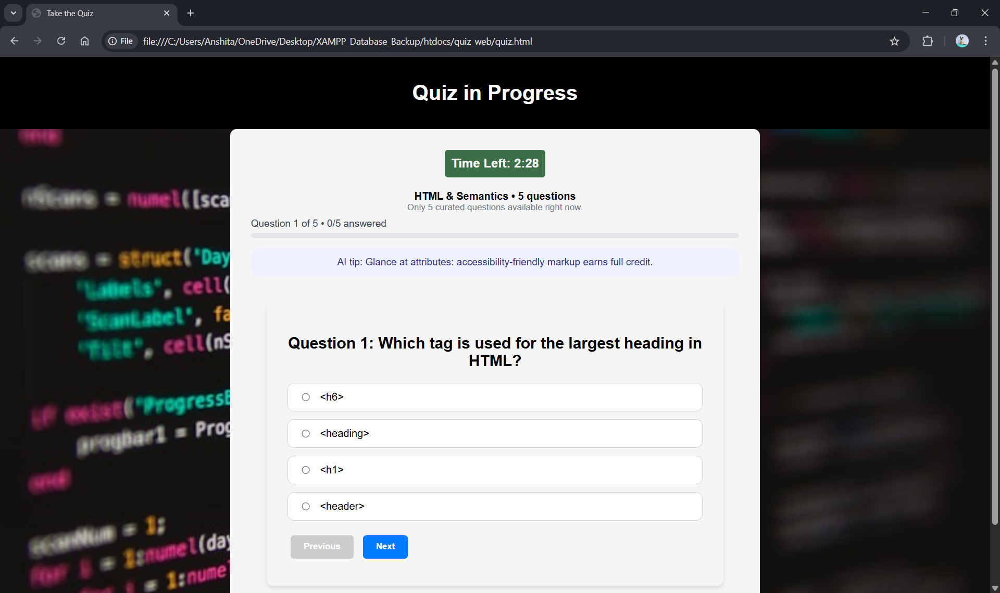
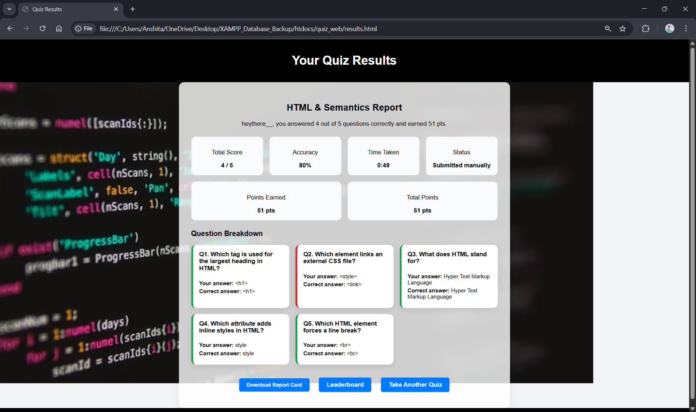
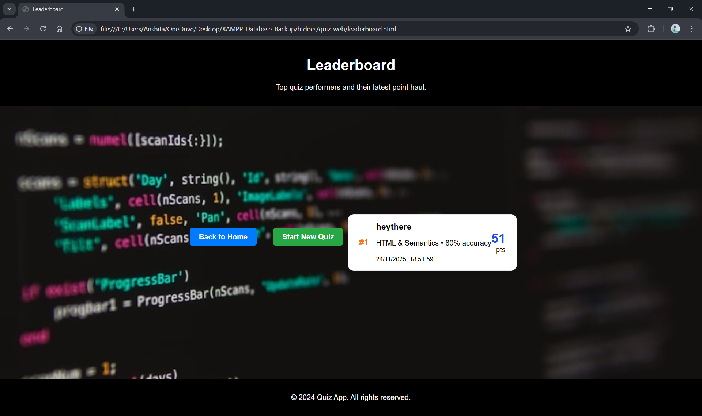

# Online Quiz Web Application 

A responsive and interactive multi-topic quiz platform built using **HTML, CSS, and JavaScript**. The application supports timed quizzes, scoring, user statistics, and a clean UI designed for smooth user experience. Works completely on the client-side using **LocalStorage** for saving data.

This is my updated version of project.
---

## 🚀 Features

- **Multiple quiz categories**  
- **Timer-based quizzes**  
- **Dynamic question loading**  
- **Scoring with accuracy and bonuses**  
- **Leaderboard with rankings**  
- **Save quiz results using LocalStorage**  
- **Responsive UI for all screen sizes**  
- **Clean navigation (Home → Start → Quiz → Results)**  

---

## 🧠 Technologies Used

- **HTML5**
- **CSS3**
- **JavaScript (ES6)**
- **LocalStorage / SessionStorage**

---

## 📂 Folder Structure
online-quiz-web-app/
│
├── index.html
├── home.html
├── start.html
├── quiz.html
├── results.html
├── leaderboard.html
│
├── quiz.js
├── quiz.css
├── style.css
├── styles.css
│
└── photos/
├── Home Page.png
├── Create Quiz.png
├── Quiz.png
├── Results.png
├── Leaderboard.png
├── Login Success.png
├── Register.png
├── Register_success.png
├── Logout.png
└── Quiz Black BG.jpg

---

## 🖼 UI Screenshots

Here are some preview images from the project:

| Home Page | Quiz Page |
|----------|-----------|
|  |  |

| Results | Leaderboard |
|---------|-------------|
|  |  |

---

## ▶️ How to Run the Project

1. Download or clone the repository:
https://github.com/Anshi1310/online-quiz-web-app

3. Open the main page:

4. Start the quiz and explore all features!

No backend required — everything runs directly in your browser.

---

## 📌 Future Improvements (Optional Enhancements)

- Add more quiz categories  
- Add animations for transitions  
- Improve leaderboard UI  
- Add sound effects for correct/wrong answers  
- Add dark mode
- Link with MySQL

---

## 📄 License

This project is licensed under the **MIT License**.  
Feel free to use or improve the code.

---

## 👩‍💻 Author

**Anshita Gautam**  
Aspiring Web Developer | BCA Student  

